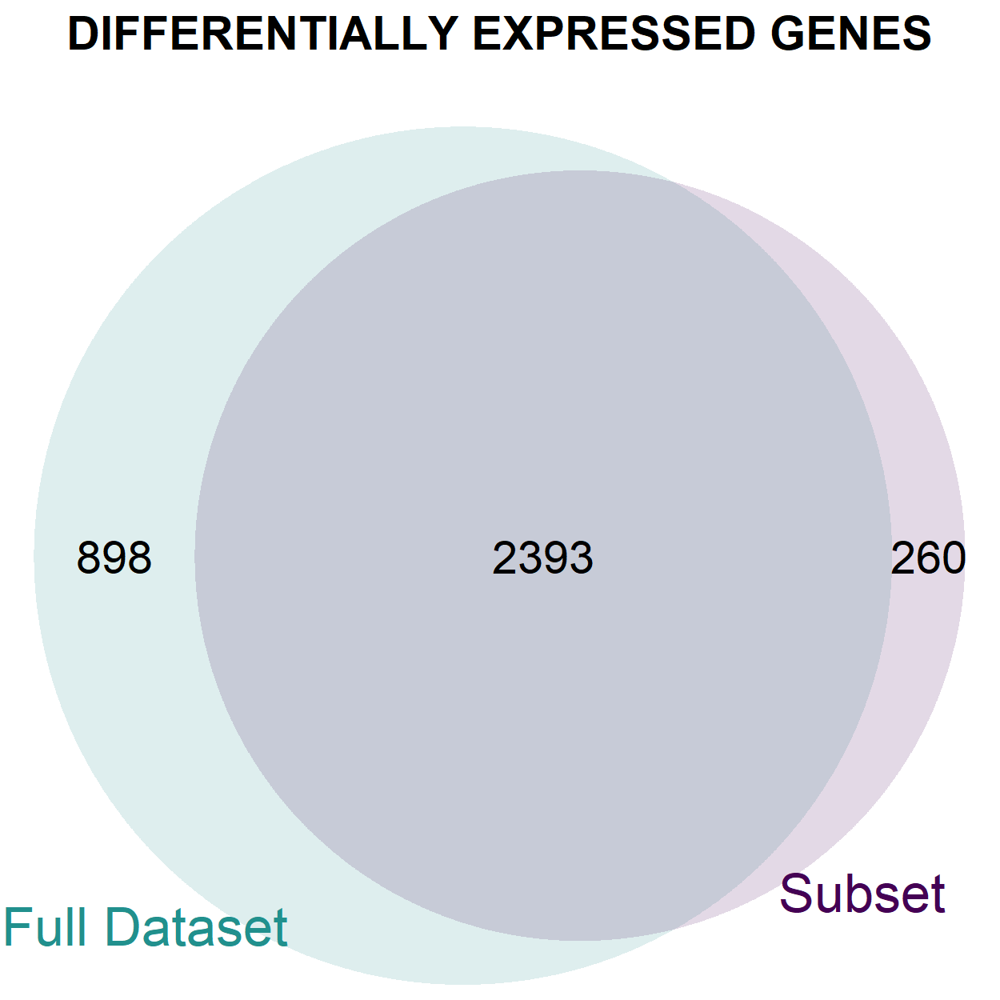

\vspace{0.5in}
\begin{center}
	\includegraphics[width=7cm]{./logo.jpg}    
\vspace{0.5in}

	\LARGE{Final Year Project}      
	
	
	\Huge{The Analysis of Gene Expression Data generated by Microarray and RNA-Seq technologies}    
	
	
	
	\Large{Author: Amanda Forde  16308191}    
	
	\Large{Supervisor: Dr. Emma Holian}    
	
	\Large{April 2020}     
	
\end{center}
\clearpage
\newpage

\underline{Declaration}

I hereby certify that this material, which I now submit for assessment on the programme of study leading to the award of Bachelor of Science (Mathematical Science) is entirely my own work and had not been taken from the work of others save and to the extent that such work has been cited and acknowledged within the text of my work.      

ID: *16308191*

Date:  *08/04/2020*

\clearpage
\newpage

\large 

**Acknowledgements**

\normalsize   

I would like to extend my sincere gratitude to Dr. Emma Holian for her dedication to assisting me in this project. I am most appreciative of her encouragement and guidance for which without, I would not have been able to complete this report.

I would also like to acknowledge the lecturers and academic staff at the School of Mathematics, Statistics and Applied Maths here in NUI, Galway. I am very grateful for their teaching and continuous support throughout my degree.


\clearpage
\newpage

\tableofcontents

\newpage

```{r setup, include=FALSE}
knitr::opts_chunk$set(echo = TRUE,comment=NULL)
knitr::opts_chunk$set(fig.path = "images/")
```

```{r, echo=F,include=FALSE,warning=FALSE}
# Load required packages: 

library(limma)
library(Biobase)
library(BiocGenerics)
library(parallel)
library(leukemiasEset)
library(RColorBrewer)
library(gplots)
library(genefilter)
library(stringr)
library(rafalib)
library(made4)
library(VennDiagram)
library(vsn)
library(hexbin)
library(ggplot2)
data("leukemiasEset")

```


# Introduction 


## Differential Expression Analysis


In a biological system, genetic information has been found to flow from DNA to RNA to proteins. This concept is referred to as the central dogma of molecular biology. Every cell of an organism contains the same genetic information but in spite of this, it is obvious that cells can have very different roles. For example, consider a blood cell and a skin cell in the human body, the tasks carried out by these two cells alone have few similarities. The reason for this is predominantly due to variances in trends of gene activation, which in turn are responsible for the control of the protein construction. This process of manufacturing proteins from the information which is stored in genes is called *gene expression*. At any given time, several inactive genes can exist within a single cell, producing none or very few copies of their respective protein. On the other hand, other genes within the same cell can have considerably high levels of activity and many copies of these particular proteins yielded. Unfortunately, estimation of the abundance of individual proteins has proven to be difficult. Therefore, a quantitative description of the expression of a gene is generally obtained by determining the number of RNA transcripts, which are associated with that gene, present in cell samples. 

Comparison of these gene expression profiles across various experimental groups can provide scientists with the ability to gain insight into the properties and functions of genes. Furthermore, changes in gene expression levels between different cells can assist in understanding why cells perform in various ways while different levels of expression in the same cells in contrasting experimental conditions can aid in the determination of differences between these conditions. A simple example is the comparison of expression levels in treated cells to those of untreated cells within subjects. This investigation may be performed in order to evaluate the effect of a particular treatment. In *differential expression analysis*, the primary concern of researchers is the identification of a subset of genes that are differentially expressed between two conditions from a large population of candidate genes. The role of the statistician in this process is to evaluate the magnitude of the difference of mean expression level between two or more conditions for each gene from the available data and assess the statistical significance of this difference. However, these tasks are often most challenging. The datasets acquired tend to be extremely large with tens of thousands of genes but in which there may only be two or three replicates for each condition of interest. In addition, it is most likely that these measurements have been greatly affected by noise. Thus, it is of interest to perform a thorough investigation of the many statistical methods which must be employed in order to overcome issues such as those mentioned, the statistical concepts which have led to their construction and of course, the manner in which these methods are implemented on real-world datasets.

The most popular technologies used in gene expression experiments today are microarrays and the next-generation sequencing technique, RNA-Seq. Even though they are employed for the same purpose of measuring RNA quantities in biological samples, there are significant differences between the two experimental procedures, especially with respect to the form of data they generate. Therefore, it will also be interesting to explore the way in which certain techniques must be altered depending on the source of the data.  


## Origin of Data


Before delving into a comprehensive investigation of statistical methodologies, it is important to understand the nature of the raw data obtained from gene expression experiments and appreciate that many pre-processing procedures must take place in order to transform this original data of great technical complexity into an appropriate form for analysis. 

\    

**Microarrays:**

Microarray technologies can be divided into two main categories: cDNA microarrays and oligonucleotide *probe-set* arrays. While sharing many common traits, the two procedures are differentiated by a number of technical details. Since their introduction by Affymetrix, Inc. in 1994, the popularity of high-density oligonucleotide expression arrays has grown tremendously. In fact, most microarray data being generated today is of this *probe-set* type, also referred to as *single-channel* data. As the data which will be used for illustrative purposes originates from a probe-set array, the methods employed in sourcing this data type will be briefly explored.

A single-channel array is a small glass chip which consists of a series of short, single-stranded DNA sequences. These sequences are known as oligonucleotides and are commonly 25 base pairs in length. In general, each gene is represented by 16-20 pairs of oligonucleotides. These pairs of oligonucleotides are defined as probe sets, as their main purpose is to *probe*, i.e. search for, their specific complementary base sequences. Each probe set consists of a perfect match (PM) probe and a mismatch (MM) probe. PM probes are designed so that they exactly match different small segments of RNA sequences. The partner MM probe of a particular PM probe is created to merely differ from the PM probe by a single substitution of the middle base of the sequence.

An RNA sample is suitably prepared, labeled and subsequently hybridized with the array. Intensity values are obtained for each probe as a result of the production of images from the scanned array. The generated intensities quantify how much hybridization has occurred for each probe. The entire process is based on the fact that if the target sequence of a specific PM probe is present in the sample, the PM probe should hybridize to a stronger degree with this complementary base sequence than its partner MM probe. The PM intensity value contains the true signal as well as stray signal stemming from non-specific binding. The MM probes have been included in order to estimate this extra noise. The intensities from the 16-20 probe pairs representing a specific gene are combined to form a summary measurement for that gene. 

\    

**RNA-Seq:**
 
Recent years have witnessed the emergence of RNA-Seq, a new technology which can be used to generate gene expression data. Unlike microarrays, which provide continuous numerical measurements to quantify expression levels, RNA-Seq expression profiles are compiled of integer counts. This recorded count data represents the number of sequence reads obtained from a particular sample which have been mapped to each gene.

RNA-Seq is commonly considered to be superior to microarrays for several reasons. Among these include the fact that background signal has been found to be much lower with RNA-Seq, resulting from a lack of issues regarding non-specific hybridization. Furthermore, RNA-Seq is capable of quantifying a wide range of expression levels, in contrast to microarrays which can struggle with the detection of very high or very low expression levels. A brief description of the complex steps of RNA-Seq experimental process is provided as follows.
 

Prior to sequencing, the RNA must first be extracted from the cell sample. The method proceeds by transforming this population of RNA into numerous cDNA fragments. The collection of these fragments is known as a library. The addition of adapters to each end of the fragments takes place to enable hybridization to a *flowcell*, a small glass slide with microfluidic chambers. Following this step, each individual fragment is clonally amplified to guarantee that the sequencing signal for detection is sufficiently strong. The cDNA library is now of a suitable form to undergo sequencing using the sequencing platform of choice. The depth to which the library is sequenced can depend on several factors.
This sequencing process results in a great number of short sequence reads. The genomic origin of each read must then be established in order to determine the RNA transcripts present in the sample at hand. The alignment of reads to the reference genome is referred to as mapping. As the objective of the RNA-Seq experiment is to provide a measurement of gene expression, the number of sequence reads that overlap with known genes are counted once each read has been associated with its locus of origin. Thus, for each sample and each gene, the RNA-Seq process provides a positive integer designed to represent the expression level of the gene in the sample. 


## Introduction to `limma` and Linear Models

The `limma` package is a key element of the open-source software designed for bioinformaticians, `Bioconductor`, which can be used through the interface of `R`, (@limmacite, @bioconcite). It has been developed to provide an accessible and statistically rigorous platform for the analysis of data obtained from gene expression experiments. Originally, `limma`  gained popularity for its ability to conduct thorough analyses of microarray data. However, the availability of `limma`'s functions have been recently extended to new technologies such as that of RNA-Seq. Once initial pre-processing and normalisation procedures have taken place, `limma` can supply users with the ability to perform differential expression analyses on data arising from both microarray and RNA-Seq technologies in a very similar manner. For this reason, there will be much focus on the statistical methods used by `limma`. 

The combination of many core statistical concepts in a manner which has proven to be most effective can be seen in `limma`. Differential expression is evaluated through the employment of a linear modelling approach in which linear models are fitted to normalised expression measurements of each gene. The adaptability of these models permits the analysis of experiments with complex design as the models can be adjusted to take into account a variety of treatment factors. Another key component of `limma` is its empirical Bayes procedures which borrow information across genes. These methods are included to enable each gene to have its own specific variance estimate and ensure that stable analyses take place even when only a small number of samples are available. 


As the use of linear models will be a dominant feature throughout this investigation of differential expression analysis, a brief introduction to the way in which the application of linear models can result in inferences being made regarding gene expression levels is provided as follows. A simple example is considered where the intention is to assess the effect of a proposed treatment, Treatment A say. The question of interest, with respect to differential gene expression, may then be to determine differences in gene expression levels between samples extracted from treated cells and those which have been taken from untreated cells. Following this, the identification of genes which are over-(under-) expressed may most likely be required. In the context of statistical modelling, the measurement of expression level of a particular gene is recognised as the response variable while the characteristic of being either treated or untreated is the predictor categorical variable. If expression measurements are assumed to be normally distributed, a linear regression model for gene $g$ may take the following form: $$Y_{i} = \beta_{0} + \beta_{1}X_i + \epsilon_i$$
for which: 

- $Y_i$ specifies the expression level of gene $g$ for sample $i$,
- $\beta_0$ is the mean expression level in untreated samples for this gene,
- $\beta_1$ is the mean difference/change in expression level from untreated to treated samples,
- $X_i$ is the treatment status of sample $i$, a discrete parameter which takes values 0 or 1, with 0 = untreated while 1 = treated,
- $\epsilon_i$ represents random noise. 

The standard assumption of this particular model is that the error terms, $\epsilon_i$, are independent and identically distributed random variables with $\epsilon_i \sim N(0,\sigma^2)$.

A linear model such as the one above is often used for prediction purposes, in which an estimation for $Y_i$ is desired for a given value of $X_i$. However, in this application of linear models, it is the values of the coefficients, $\beta_j$ that are of most importance. It is evident from the equation above that $\beta_1$ is the coefficient which captures the magnitude of the difference in expression levels between the two groups of samples, treated and untreated. Therefore, in order to assess if this gene $g$ is differentially expressed, an appropriate hypothesis test is conducted. This hypothesis test takes the form: $$H_0: \beta_1 = 0 \text{ vs } H_A: \beta_1 \ne 0$$ and the test statistic, namely the $t$-statistic, defined by $$t_1 = \frac{\hat \beta_1}{se(\hat\beta_1)},$$ is used to evaluate how close $\beta_1$ is to zero. The computation of this $t$-statistic occurs using the estimate of $\beta_1$, $\hat \beta_1$, and its associated standard error, $se(\hat\beta_1)$ which have been obtained as a result of fitting the above linear model to the available data. Under the null hypothesis, $H_0$, the $t$-statistic follows a $t$-distribution with $n - p - 1$ degrees of freedom, in which $n$ is the number of samples and $p$ is the number of predictor variables in the model. The probability of observing this $t$-statistic, or indeed a value more extreme than it, under the null hypothesis, can then be obtained. This probability is referred to as a $p$-value and is often compared with a previously specified significance level, $\alpha$. If the $p$-value is less than $\alpha$, the null hypothesis, $H_0: \beta_1 = 0$ is rejected and it is concluded that there is sufficient evidence to indicate that the gene $g$ is differentially expressed between the two conditions of interest. 


This is indeed a simplified description of the linear modelling procedure as it is extremely rare that raw experimental data would be normally distributed. However, it provides a basic comprehension of the rationality behind the implementation of linear models in differential expression analysis. Furthermore, the parallel nature of performing this same test for many, many genes must be accounted for. This concept of multiple testing and the appropriate adjustments which must be made will be explored in Section 2.

\      

# Multiple Testing

## The Multiplicity Problem

One of the principal statistical issues that bioinformaticians must regularly face is that of the multiplicity problem. This issue is certainly not unique to gene expression experiments. However, its magnitude is dramatically intensified as each experiment can consist of thousands of genes. In order to identify a small portion of genes which are differentially expressed between experimental conditions from a large pool of candidate genes, thousands of comparison tests must be performed. The result of this is a sharp increase in the likelihood of obtaining false positive results. Therefore, it is clear that when performing differential expression analysis, incorporation of a procedure which appropriately corrects for multiple testing is most important. 
 

First, consider the performance of a hypothesis test for statistical significance of differential expression for one individual gene, similar to that described in Section 1.3. The null hypothesis, $H_0$ is that the gene shows no difference in expression between the two conditions of interest. A $t$-statistic is computed and used to produce a $p$-value, the probability of obtaining the $t$-statistic under $H_0$. The gene is recognized as being differentially expressed if this $p$-value is less than the significance level of this single hypothesis test, $\alpha$. However, it may be merely random effects that are responsible for this extreme $t$-statistic and small $p$-value. If this is the case, an error has been made in identifying the gene as differentially expressed. The null hypothesis, $H_0$ has been rejected when it is in fact true. This is known as a Type I error and the probability of making this error is exactly $\alpha$. It follows that the probability of the correct conclusion being deduced for this particular gene is then $1 - \alpha$.  

For a situation in which many associated hypotheses are tested, the probability that a false positive error, such as the one described above, is committed is witnessed to increase greatly. Consider $m$ associated hypothesis tests. As stated, the probability of not making a Type I error for a single hypothesis test is $1 - \alpha$. For $m$ tests, the probability of not making a Type I error reduces to $(1 - \alpha)^m$. However, this means that the chance of making at least one false positive error is now represented by the value $1- (1-\alpha)^m$. This number grows at a rapid rate, eventually reaching extremely close to 1, as demonstrated in Figure \ref{fig:error}. 

```{r error, fig.align='center', echo=FALSE, fig.height=3, fig.width=4, out.width='60%', fig.cap='\\label{fig:error}\\textit{The number of hypothesis tests, on the x-axis, is plotted against the probability that the number of type I errors committed is greater than or equal to 1, on the y-axis.}'}

alpha <- 0.05
library(lattice)
distribution<-function(x) {1-(1-alpha)^x}
X<-seq(0,100,0.01)
xyplot(distribution(X)~X,type="l", col = rgb(red = 255, green = 90, blue = 0, maxColorValue = 255), cex.lab = 3.5, cex.axis = 3.5, lwd=2, xlab=expression('no. of hypothesis tests ' (italic('m'))), ylab='P(no. type I errors >= 1)')
```


In a typical experiment, at least $10,000$  separate hypothesis tests may be executed. Suppose data from a gene expression experiment has been obtained in which exactly $100$ genes are known to be differentially expressed. If a gene-by-gene significance level of $\alpha = 0.05$ is chosen, then approximately $495$ out of the ordinary $9,900$ genes would also be expected to be deemed significant merely by chance. Even if the testing procedure accomplishes the task of determining the $100$ differentially expressed genes, they will be easily lost in the large pool of $495$ false predictions. This results in a false positive rate of $\approx 83.19$% in the final set of predicted differentially expressed genes. 

It is clear from this simple example that in this process of performing many associated comparison tests in parallel, a hypothesis testing approach which is deemed perfectly valid when applied to a single gene can potentially produce significant errors when analyzing data for thousands of genes. Thus, extreme caution must be taken when attempting to draw conclusions from the results of a testing procedure in which no corrections for multiple testing have been implemented. Recognition of the enormity of this issue has led to the focus of considerable attention to determining methods which can achieve acceptable control of the type I error rate. Commonly used approaches regularly involve adjusting the individual $p$-values obtained during the hypothesis testing procedure. 

In this complicated task of differential expression prediction, there are two ways in which false positive rates are commonly understood, the *Family-Wise Error Rate* (FWER) and the *False Discovery Rate* (FDR). The *Family-Wise Error Rate* is the probability that at least one type I error is committed, while the *False Discovery Rate* describes the expected proportion of false positive errors which exist among the total number of rejected hypotheses. Assuming that $m$ hypotheses are being tested, $H^1, H^2, \dots , H^m$, let $R$ represent the total number of rejected hypotheses and $V$ signify the number of type I errors that have been made. Then,    
 $$\text{FWER} = P(V \ge 1)$$
 $$\text{FDR} = E\left(\frac{V}{R} | R > 0 \right)P(R > 0)$$

A procedure is said to control the FWER or FDR at a specific level $\alpha$, if the FWER or FDR is known to be less than $\alpha$. Details of methods commonly implemented to control these rates is provided below.


## Family-Wise Error Rate (FWER)

Consider a case where the intention is to carry out $m$ hypothesis tests and $m_0$ of the null hypotheses are in fact true. Then, the family-wise error rate (FWER) is simply the probability that at least one of the $m_0$ null hypotheses is rejected as a result of the performed hypothesis testing procedure. 

One of the most simplistic approaches to ensuring that this FWER remains at a specified acceptable value, $\alpha$, is the Bonferroni correction, (@bonf). When controlling the FWER for a total number of $m$ associated comparison tests, the task is to determine the significance level required for each individual hypothesis test in order to ensure that the global Type I error is less than or equal to $\alpha$. It is perhaps intuitive that in order to meet this requirement, the Type I error of each individual test must be reduced to a number much smaller than $\alpha$, depending on the number of statistical tests being carried out. First, $p$-values are generated for each hypothesis test corresponding to each gene. Let $p_i$ represent the $p$-value for gene $i$. The Bonferroni correction method proceeds by implementing a Type I error of $\frac{\alpha}{m}$ for each individual hypothesis test. All hypotheses for which $p_i < \frac{\alpha}{m}$ are subsequently rejected. Equivalently, each $p_i$ may be corrected through multiplication by $m$ to form a new value, $\tilde{p_i} = p_im$ and $\tilde{p_i}$ is compared with $\alpha$. In a similar fashion, if $\tilde{p_i} < \alpha$, the null hypothesis for gene $i$, $H_0^i$ is rejected. Thus, the Bonferroni correction procedure guarantees weak control of the experiment-level Type I error, the FWER at level $\alpha$. 

However, it is known that a fundamental issue of many approaches which focus on controlling the FWER, regardless of number of hypotheses being tested, is that of over-conservativeness. It can be deduced that after implementation of the Bonferroni correction method, if gene $i$ is found to be significant, then it is truly differentially expressed. However, due to the stringency of the procedure for a large number of $m$ tests, a gene which is expressed to a substantially different extent between experimental groups could still be deemed insignificant. This strictness results in a considerable loss of available power to detect expression changes for particular genes, leading to many missed findings. Thus, in the context of gene expression analysis, methods which aim to control the FWER are generally deemed unsuitable. This is primarily due to the fact that as the number of genes increases, the corrected probability of a Type I error at gene-level becomes very small. At this level, it is very difficult to succeed in rejecting the null hypotheses which are actually false. Attempts to counteract this conservativeness include raising the FWER to a figure greater than 0.05. However, increasing this probability of at least one false positive cannot control the amount of false positives allowed. 


 

## False Discovery Rate (FDR)

Essentially, the aim of overcoming the multiple testing issue is to find an approach which not only locates as many genes as possible which are expressed differently in contrasting experimental conditions but also ensures that a reasonably small proportion of false positives have been incurred. In order to achieve this, it has been recognized that emphasis on the proportion of false positives among the rejected hypothesis tests is more appropriate. The false discovery rate (FDR) was introduced by @Benj and originally defined it as the expectation of this proportion.
More formally, an FDR approach is designed to control the expected proportion of false positives among the set of rejected hypotheses, $R$ at some prescribed value $\delta$, in which $V$ is the number of falsely rejected genes: $$ \text{FDR} = E\left(\frac{V}{R} | R > 0 \right)P(R > 0). $$

FDR approaches to multiple testing have gained great popularity in data analysis which attempts to recognise differentially expressed genes. This is predominantly due to the less stringent nature of the false discovery rate, which allows it to be more powerful than other correction methods. Consider an experiment which has produced data for a total of $10,000$ genes, with $100$ of these genes being diagnosed as differentially expressed on account of the enforcement of a hypothesis testing procedure. The null hypothesis, $H_0^i$ was rejected for each of these $100$ genes. As an example, an FDR of $50%$ would lead to 50 truly differentially expressed genes among this group of $100$ candidate genes. A set of predictions such as this would in fact be considered suitable for a follow-up verification experimental method such as polymerase chain reaction (PCR).

\  

**Benjamini and Hochberg Method:**

As stated above, @Benj are responsible for the development of the original procedure of controlling the FDR. The testing method may be described as follows. 

The $p$-values, $p_1, p_2, \dots, p_m$ are generated gene-by-gene from a total of $m$ hypothesis tests, under $m$ individual null hypotheses. These $m$ $p$-values are assumed to be independent. Suppose that $m_0$ of these null hypotheses are actually true. It is worth noting that at this stage of the process, which hypotheses are true and which are false remains unknown. The unadjusted $p$-values computed in this first step are now re-ordered from smallest to largest. The $i$th smallest of all $p$-values is denoted as $p_{(i)}$ with corresponding null hypothesis  $H_0^{(j)}$, so that $p_{(1)} \le p_{(2)} \le \cdots \le  p_{(g)}$.
With $\delta$ representing the chosen false discovery rate, $q_i$ is defined as: $$q_i = \frac{i}{m}\delta, \;\;\;\; i=1,\dots,m.$$ Each $p$-value, $p_{(i)}$ is compared with its complementary $q_i$ and the hypothesis test with the highest rank, i.e. largest value $i$, for which the inequality $p_{(i)} \le q_i$ holds is sought out. If the highest ranking test which satifies this condition is denoted as $H_0^{(k)}$, then all tests of rank $1,2,\dots,k$ are declared to be significant as for all $i=1,2,\dots,k$, $p_{(i)} \le q_i$. The null hypothesis $H_0^{(1)},...,H_0^{(k)}$ are rejected while the null hypotheses $H_0^{(k+1)},...,H_0^{(m)}$ are accepted. 

In fact, it can be proven that this procedure precisely controls the FDR to the level $\frac{m_0}{m}\delta$, which is at the very most $\delta$. In general, all adjustment procedures tend to result in the reduction of statistical power. However, the power losses are drastically smaller for the BH method than the Bonferrroni procedure detailed above.  

The construction of this method to control the false discovery rate assumes that the $m$ hypothesis tests are all independent. With gene expression data, the idea that the numerous performed hypothesis tests would be truly independent is most unlikely. That said, there is little proof as to the exact form which a dependence structure may take between the expression levels of various genes. It was proven by @BenYek that the BH procedure does in fact control the FDR at level less than or equal to $\frac{m_0}{m}\delta$ for the case in which there is a positive regression dependence between the different hypothesis tests. The BH method was also extended by @BenYek to take into an account an arbitrary dependence structure in which $q_i$ in the above explanation is redefined as:  $$q_i = \frac{\delta i}{g \sum^g_{j=1}\frac{1}{j}}.$$ 
A negative characteristic of this BY method is that it is generally more conservative than the BH procedure. For this reason, the BH procedure is still often preferred. In fact, the default method used by the `limma` software package for adjusting $p$-values to account for multiple testing is the BH method while options to use the Bonferroni correction and BY methods are also provided. 


\     

# Analysis of Microarray Data 


## Normalisation of Microarray Data

Throughout the microarray experimental process, which has been briefly detailed in Section 1.2, the introduction of many sources of variation can occur as there are numerous steps required which are not exactly reproducible. Technical error can be introduced at any technical stage of the experiment such as sample preparation and even, array manufacturing. As the intent is to detect the biological differences in gene expression, comparing data from arrays in which variation of non-biological origin hasn't been minimized can lead to extremely misleading results. Therefore, implementation of normalisation procedures which aim to remove technical variation are essential prior to analysis. 

Many methods for extracting gene expression measurements from the raw intensity data obtained from high-density oligonucleotide arrays which incorporate normalisation steps have been proposed over the last two decades. One method which attempts to perform this task efficiently is that suggested by @Iriz, known as the robust multi-array average (RMA) method. Let $PM_{ijn}$ denote the intensity obtained for an individual PM probe. The values $n$, $i$ and $j$ represent the specific gene, RNA sample and probe set, respectively. This probe set number identifies the physical position in the gene of the oligonucleotide in question. The method may be separated into three individual steps. 

First, background correction of each array must be performed in order to adjust for the effects of optical noise and hybridization that is not associated with specific binding between probes and their target sequence. This task is completed with the assistance of a transformation, $B(\cdot)$. A model of the form $PM_{ijn} = bg_{ijn} + s_{ijn}$ is imposed on each probe, in which $bg_{ijn}$ symbolizes the background signal in the sample $i$ and $s_{ijn}$, the true signal. It is assumed that each array $i$ has a mean background signal of $E(bg_{ijn}) = \beta_{i}.$ Then, in order to remove this background effect, an appropriate transformation is specified by $B(PM_{ijn}) \equiv E(s_{ijn}|PM_{ijn}).$  With $B(PM_{ijn}) > 0$,  $B(\cdot)$ is defined as the closed-form transformation obtained when assuming $s_{ijn}$ to be exponential and $bg_{ijn}$ normal.

Following this, technical errors are removed using quantile normalisation. The aim of this approach is to ensure that the probe intensity distribution is the same for all arrays so that data can be compared across samples. Probe level data from all arrays are mapped by this normalisation so that an $I$-dimensional quantile-quantile (q-q) plot follows the $I$-dimensional identity line, in which $I$ is the total number of arrays. 
 
Finally, summarization takes place. This involves the combination of multiple intensities into a single number which can be understood as a measurement of gene expression. Let $Y$ denote the background-adjusted, normalized and log-transformed $PM$ intensities. This $Y$ is assumed to follow the linear model: $$Y_{ijn} = \mu_{in} + \alpha_{jn} + \epsilon_{ijn}$$ in which $\alpha_j$ specifies a probe affinity effect and $\epsilon_{ij}$ represents the standard error terms, independently and identically distributed with a mean of zero. Model parameters are estimated using a robust procedure in order to safeguard against outliers. Log scale expression levels for array $i$ are provided by the estimate of $\mu_i$. This is referred to as the robust multi-array average (RMA). 


## The `leukemiasEset` Dataset


The dataset chosen to gain a comprehension of the fundamental concepts of differential gene expression analysis was obtained from the `Bioconductor` package, `leukemiasEset`. The data is presented within an object of the `ExpressionSet` class, a form appropriate for insertion into the `limma` analysis pipeline. Gene expression data from a total of 60 samples of individual patients is contained in this object. 12 samples are derived from each of four different leukemia types: Acute Lymphoblastic Leukemia (ALL), Acute Myeloid Leukemia (AML), Chronic Lymphocytic Leukemia (CLL) and Chronic Myeloid Leukemia (CML). In addition, control samples were included from 12 healthy non-leukemia individuals (NoL). These 60 samples are a small subset of the samples collected by the Microarray Innovations in Leukemia (MILE) study (@Leuk1, @Leuk2).

The gene expressions were measured by high-density oligonucleotide arrays, namely Affymetrix Human Genome U133 Plus 2.0, in which mononuclear cells from bone marrow tissues of each patient were hybridized. The arrays were subjected to the RMA normalisation procedure, outlined in Section 3.1 above. The description of this procedure provides an understanding of the way in which the single log-intensity values for each gene in each sample have been produced. The total number of $20,172$ genes have been identified with their corresponding Gene Ensembl IDs. These expression values are contained within a large matrix in which rows represent different genes and the columns relate to the various samples. The expression values of the first $4$ genes which have been generated for the first $4$ `ALL` samples are shown directly below. 


```{r, echo=FALSE}
new_names <- substr(sampleNames(leukemiasEset),start=6,stop=9)
sampleNames(leukemiasEset) <- new_names
sampleNames(leukemiasEset) <- paste(pData(leukemiasEset)$LeukemiaType, sampleNames(leukemiasEset),sep="_")
exprs(leukemiasEset)[1:4,1:4]
```


```{r, include=FALSE}
## Investigate what's contained in dataset:
# View the no. of features (rows) and samples (columns):

dim(leukemiasEset)
# First 5 rows and columns of expression data:

exprs(leukemiasEset)[1:5,1:5]
# First 6 rows of phenotype data:

head(pData(leukemiasEset))
# First 10 feature names i.e. gene identifiers:
featureNames(leukemiasEset)[1:10]
# First 3 rows and columns of feature data:


```

Preliminary exploration of the data may include the production of visual summaries of the expression values for certain genes using a boxplot. The plots underneath, in Figure \ref{fig:boxplots}, depict how the expression measurements for two genes vary across the $5$ different conditions of this dataset. 


```{r boxplots, echo=FALSE, out.width='90%', fig.align='center', fig.cap='\\label{fig:boxplots}\\textit{Boxplots showing gene expression levels across five different leukemia types for ORM1 gene, on the left, and MRPS23 gene, on the right.}'}
par(mfrow=c(1,2))
# two genes which are present in top 5 of both types of analysis below
col.cell <- brewer.pal(5,"Dark2")
boxplot(exprs(leukemiasEset)["ENSG00000229314",] ~ pData(leukemiasEset)[,"LeukemiaType"], main="ORM1", xlab='Leukemia Type', ylab='Gene Expression',border=col.cell, las=2)
boxplot(exprs(leukemiasEset)["ENSG00000181610",] ~ pData(leukemiasEset)[,"LeukemiaType"], main="MRPS23", xlab='Leukemia Type', ylab='Gene Expression',border=col.cell, las=2)


#par(mfrow=c(1,1))
#nsamples <- ncol(exprs(leukemiasEset))
#nsamples
#col_1 <- brewer.pal(12,"Paired")
#col_2 <- brewer.pal(12, "Set3")
#col_3 <- brewer.pal(8,"Accent")
#col_4 <- brewer.pal(8,"Dark2")
#col_5 <- brewer.pal(9,"Pastel1")
#col_6 <- brewer.pal(8,"Set1")
#col_7 <- brewer.pal(3,"Set2")
#col <- c(col_1,col_2,col_3,col_4,col_5,col_6,col_7)
#plot(density(exprs(leukemiasEset)[,1]), col=col[1],lwd=2, ylim=c(0,0.35), las=2, main="", xlab="")
#title(main=" ", xlab=" ")
#for (i in 2:nsamples){
# den <- density(exprs(leukemiasEset)[,i])
#  lines(den$x, den$y, col=col[i], lwd=2)
#}
#legend("topright", legend = colnames(exprs(leukemiasEset)), fill=col, cex=0.5)

#legend("topleft",fill=c("red","dark green","blue"),legend=levels(sampleinfo$Status),cex=0.6)

#fig.cap='Boxplots showing gene expression levels across five different leukemia types for ORM1 gene, on the left, and MRPS23 gene, on the right.'
```

```{r ORM, fig.width=3.25,fig.height=4,include=FALSE}
boxplot(exprs(leukemiasEset)["ENSG00000229314",] ~ pData(leukemiasEset)[,"LeukemiaType"], main="ORM1", xlab='Leukemia Type', ylab='Gene Expression',border=col.cell, las=2)
```


In the first boxplot, it is clear that there seems to be a substantial difference in expression levels for the ORM1 gene, identified by Ensembl ID: ENSG00000229314, between `NoL` samples and samples from `AML`, `ALL` and `CLL` patients. This indicates that this gene may be differentially expressed with respect to a contrast between groups `NoL` and `AML`, for example. 
The second boxplot shows little change in the means across the various types of leukemia. It would thus be expected that the MRPS23 gene, with Ensembl ID: ENSG00000181610, would not be differentially expressed when two particular conditions of this group are compared.  
Certainly, constructing boxplots and relying on judgments made by eye is an inadequate method in the assessment of which genes are differentially expressed. However, this visualisation technique can provide an insight into what may be expected in further analysis. 


```{r, include=FALSE}
## Specifying a linear model: 
# Relevel: intuitive that "NoL" would be our reference level!
pData(leukemiasEset)$LeukemiaType <- relevel(pData(leukemiasEset)$LeukemiaType, ref="NoL")


# A design in which we wich to compare "AML" and "NoL" but still use all the data:
LeukemiaType = factor(leukemiasEset$LeukemiaType)
design <- model.matrix( ~ LeukemiaType-1)
head(design)
colnames(design) <- c("NoL","ALL","AML","CLL","CML")
fit <- lmFit(leukemiasEset, design)
contrast.matrix <- makeContrasts("AML-NoL", levels=design)
# cm <- makeContrasts(AMLvALL = typeAML - typeALL, CMLvALL = typeCML - typeALL, CMLvAML = typeCML - typeAML,levels = design)
# note that biggest difference between CML and ALL types, suggesting that these two subtypes have biggest differences in cellular function, consistent with known cancer biology 
contrast.matrix
fitC <- contrasts.fit(fit, contrast.matrix)
fitC <- eBayes(fitC)
results <- decideTests(fitC,adjust.method="BH")
summary(results)
stats <- topTable(fitC,number=3291) 


#adj_p_vals <- sort(stats$adj.P.Val)
#head(adj_p_vals)
#plot(-log10(adj_p_vals[1:100]))
#plot(sort(stats$P.Value)[1:1000])
#nbins <- 20
#brks <- 0:nbins/nbins
#hist(stats$adj.P.Val, col="grey", breaks=brks)


#creating a nicer topTable with gene names!
top_six_stats <- topTable(fitC,n=6)
new_names <- c("OLFM4","PADI4","CHIT1","ORM1","CAMP","CHI3L1")
rownames(top_six_stats) <- new_names


#derivation of values obtained in top table for gene ORM1 with Ensembl gene ID!
tstat_ord_fit <- (fitC$coefficients["ENSG00000229314",])/(fitC$stdev.unscaled["ENSG00000229314",])/(fitC$sigma["ENSG00000229314"])
tstat_ord_fit
fitC$s2.post["ENSG00000229314"]
fitC$t["ENSG00000229314",]
# adjusted t statistic according to this method for chosen gene ORM1 
tstat_adj_fit <- (fitC$coefficients["ENSG00000229314",])/(fitC$stdev.unscaled["ENSG00000229314",])/sqrt((fitC$s2.post["ENSG00000229314"]))
tstat_adj_fit

fitC$df.prior[1] + fitC$df.residual[1]
2*pt(tstat_adj_fit,df=57.55538)
fitC$df.prior[1]
fitC$var.prior

# computation of odds statistic in limma with specific gene of interest
odds <- (1/99)*(sqrt(((fitC$stdev.unscaled["ENSG00000229314",])^2)/((fitC$stdev.unscaled["ENSG00000229314",])^2+fitC$var.prior)))*(((tstat_adj_fit)^2 +fitC$df.prior[1] + fitC$df.residual[1])/(((tstat_adj_fit)^2)*((((fitC$stdev.unscaled["ENSG00000229314",])^2)/((fitC$stdev.unscaled["ENSG00000229314",])^2+fitC$var.prior))) +fitC$df.prior[1] + fitC$df.residual[1]))^((1++fitC$df.prior[1] + fitC$df.residual[1])/2)
lodds <- log(odds)
```


## Application of Linear Models with `limma` 

As mentioned previously in Section 1.2, the `limma` package utilizes a linear modelling approach in order to perform analyses on microarray experiments and have success in the identification of genes that are differentially expressed. For data which has been obtained from a single-channel oligonucleotide experiment such as that provided in the `leukemiasEset` package, the linear modelling process is most similar to the common analysis of variance or multiple regression procedures. However, in this instance, a linear model is fitted to each individual gene. It is generally the case that `limma` is presented with a large number of genes, possibly tens of thousands, in which it must apply this linear modelling technique. For example, information relating to $20,172$ different genes is witnessed in this Leukemia dataset. 


Consider the assumption that for a set of $n$ samples, expression measurements for a large quantity of genes have been obtained and combined in a response vector,  $y^T_g = (y_{g1},\cdots,y_{gn})$. For single-channel data, $y^T_g$ represents the log-intensities which have been yielded for a gene $g$ across all $n$ microarrays. These expression measurements are assumed to be of a suitable form for analysis, i.e. appropriate normalisation has taken place resulting in $y_{gi} \sim N(\mu_{gi},\sigma^2_g)$. As has been previously noted, in the leukemia dataset at hand, a single expression value has been produced for each of the $20,172$ genes for each of the $60$ arrays. 


A linear model is fitted to each gene using the `limma` function `lmFit()`. The intention is that this 
linear model would completely model the systematic part of the available data. Thus, the linear model may be given in a general form as: $$E(y_g) = X\alpha_g,$$ where $X$ is the *design* matrix and $\alpha_g$ is the coefficient vector. 

The construction of the design matrix which specifies the linear model is as follows. With log-intensity data of this type, design matrices can be created exactly as in classical linear model practice with univariate data. The overall experimental layout is essentially based on a small number of biological factors, such as the type of leukemia a patient has been diagnosed with. Therefore, it is these factors which are recognised as being the independent variables that influence the response variable, a measurement of gene expression, denoted $y_{gi}$. These predictors are of a categorical nature. The design matrix can be easily used to illustrate the manner in which the researcher intends to code this biological information. Each row of the matrix usually corresponds to an experimental array and each column is used as a descriptor of the origin of the samples which have been applied to the arrays.
 
An appropriate design matrix can be created in `limma` using `model.matrix()`. In relation to the example discussed throughout, the design matrix is formed with a total of $60$ rows and $5$ columns, a column for each type of leukemia presented in the dataset. The first six rows of this design matrix are of the form:
```{r,echo=FALSE}
head(design)
```
The value 1 which is present in the `ALL` column of these rows indicate that the first six samples have been obtained from patients suffering with Acute Lymphoblastic Leukemia. The remaining rows of the design matrix are of a similar nature. Take for example a row representing an array to which cells from healthy bone marrow tissue have been applied, a 1 will be visible in the `NoL` column of this row. 

It is known that there are several ways in which the analysis of a microarray experiment can be approached and questions of interest investigated with the assistance of `limma`. However, one of the simplest strategies is to construct a straightforward design matrix as has been done above and to then proceed by extracting specific contrasts of interest from the fit. This is the primary reason that specification of the model in the manner above does not include an intercept coefficient or a reference level. Therefore, all possible comparisons may now take place between these initial coefficients, identified by the vector $\alpha_g$ for gene $g$, in order to answer questions that may be proposed. In order to accomplish this, an additional matrix, the *contrast* matrix, must be established. This *contrast* matrix $C$ permits the extraction of constants of biological interest $\beta_g$ from the coefficient vector $\alpha_g$ as $\beta_g = C^T\alpha_g$.  

For illustrative purposes, the intention will be to determine the genes which are differentially expressed between the two groups, `NoL` and `AML`. In order to investigate this appropriately, the extraction of the difference between the coefficients specifically related to these two groups as a contrast must occur. The suitable contrast matrix for this question of interest is assembled in `limma` using `makeContrasts()` and is found to be: 
```{r,echo=FALSE}
contrast.matrix
```


The variance associated with the response vector for gene $g$, $y_g$ may be given as: $$var(y_g) = W_g\sigma^2_g,$$ with $W_g$, a known non-negative definite weight matrix. Therefore, the linear model for gene $g$ is understood to have residual variance $\sigma^2_g$, which has sample value $s^2_g$ and degrees of freedom $d_g$. Indeed, estimation of the variability of each gene in the data set is the key focus of this first step of fitting a separate linear model to each gene. It is worth noting that this process allows for the accommodation of different variances for each gene. It is important that the systematic part must be modelled in the correct manner so that random variation, which plays an important role in hypothesis testing, can be distinguished. 
 
The result of the application of linear models is the generation of coefficient estimators $\hat\alpha_g$ of $\alpha_g$. It is discovered that in the leukemia dataset, for gene $g$, $\hat\alpha_g$ is merely found to be a vector where the values are equivalent to the mean log-intensity of the gene across samples for each leukemia type. This is due to the fact that a "group-means" parametrization has been chosen. In addition, the production of the estimators $s^2_g$ of $\sigma^2_g$ and the estimated covariance matrices $var(\hat\alpha_g)=V_gs_g^2$ where $V_g$ is a positive definite matrix, independent of $s^2_g$, takes place. Following this, the contrast estimators $\hat\beta_g=C^T\hat\alpha_g$ together with the estimated covariance matrix $var(\hat\beta_g)=C^TV_gCs_g^2$ can be attained in using $\beta_g = C^T\alpha_g$. The `limma` function `contrasts.fit()` computes $\hat\beta_{gj}$ and associated standard errors. 

When the desire is to obtain a number of genes that are considered to be differentially expressed between two experimental conditions and if the contrast matrix has been set up in the correct manner, then what is essentially of interest is the evaluation of whether the contrast values $\beta_{gj}$ are equal to zero. Therefore, in the usual context of hypothesis testing, the null hypotheses $H_0 : \beta_{gj} = 0$ are to be tested. 

In the current situation where a single contrast between two groups, `NoL` and `AML`, is of interest, $\beta_{gj}$ can be denoted simply as $\beta_g$ as it is a single value rather than a vector. The null hypothesis is established as $H_0: \beta_{g} = 0$ along with the alternative hypothesis of $H_A: \beta_{g} \ne 0$. It is rather easy to see that testing this null hypothesis is analogous to testing if $\alpha_{g3} - \alpha_{g1} = 0$ where $\alpha_{g1}$ is considered to be the average expression of gene $g$ in all `NoL` samples and $\alpha_{g3}$, the average expression in all `AML` samples. Rejecting the null hypothesis in this instance provides evidence for differential expression between the two conditions being compared. 

However, in order to test the hypothesis $H_0 : \beta_{gj} = 0$ which requires the computation of a test statistic, assumptions regarding the underlying distributions of the contrast estimators $\hat\beta_g$ must be made. These estimators $\hat\beta_g$ are assumed to be normally distributed with mean $\beta_g$ and covariance matrix $C^TV_gC\sigma_g^2$. In addition to this, the residual variances $s^2_g$ are understood to approximately follow a scaled chi-square distribution. The unscaled standard deviations are determined as the square roots of the diagonal elements of $C^TV_gC$. Allowing $v_{gj}$ to represent the $j$th diagonal element of $C^TV_gC$, i.e. $(C^TV_gC)_{jj}$, these distributional assumptions may be summarized by $$\hat\beta_{gj}|\beta_{gj},\sigma^2_g \sim N(\beta_{gj},v_{gj}\sigma^2_g)$$ and $$s^2_g|\sigma^2_g \sim \frac{\sigma^2_g}{d_g}\chi^2_{d_g}$$ in which the residual degrees of freedom for the linear model for gene $g$ is given by $d_g$. 

At this point, under the assumptions which have been outlined, the ordinary $t$ statistic for the $j$th contrast for gene $g$ can be derived using the contrast estimators $\hat\beta_g$ and its variance estimators:
  $$t_{gj}=\frac{\hat\beta_{gj}}{s_g\sqrt{v_{gj}}}.$$ This $t$-statistic is known to follow an approximate $t$-distribution on $d_g$ degrees of freedom.
 

Consider a particular gene $g$ from our data, ORM1, which has corresponding Ensembl ID: ENSG00000229314. Upon the specification of both the design and contrast matrices which have been detailed and the subsequent application of `lmFit()` to the normalized data stored in the `ExpressionSet` object, it was found that this specific contrast estimator $\hat\beta_{ORM1}$ was computed to be `r round(fitC$coefficients["ENSG00000229314",],4)` with standard deviation `r round((fitC$sigma["ENSG00000229314"]),4)`, together with an unscaled standard deviation of `r round(fitC$stdev.unscaled["ENSG00000229314",],4)`. The $t$-statistic for ORM1 which has $d_g = 55$ degrees of freedom was determined as: $$t_{g} = \frac{\hat\beta_{g}}{s_g\sqrt{v_{g}}} = \frac{`r round(fitC$coefficients["ENSG00000229314",],4)`}{(`r round((fitC$sigma["ENSG00000229314"]),4)`)(`r round(fitC$stdev.unscaled["ENSG00000229314",],4)`)} \approx `r round(tstat_ord_fit,4)`$$

In this case, ignoring any multiple testing corrections, at a significance level of $\alpha=0.05$, the null hypothesis is rejected if $\mid t_{g}| > 2.004045.$. Thus, it is clear to see that the obtained $t$-statistic provides a very strong indication of differential expression for this chosen gene between the two conditions. 

As is to be expected, each gene tested generally possesses a different test statistic. However, this test statistic is very much dependent on the variance of the distribution. For each gene, variability of expression values can be substantially different which indicates that the probability of detection of differential expression varies from gene to gene. For example, low variability can result in the rejection of the null hypothesis even if the mean difference between conditions is of a relatively small value. Therefore, the computation of ordinary $t$-statistics for each gene, such as in the illustration above, is deemed as an unsuitable approach in correctly identifying differentially expressed genes. The empirical Bayes method employed by `limma` is a technique used to counteract this issue associated with potentially very different variabilities in gene expression for certain genes through *variance shrinkage*. The approach is based on the borrowing of information across the large number of available genes which ultimately aids in more correct inferences being made in relation to each gene. In fact, the empirical Bayes method is considered to be one of the most influential statistical methods that have been developed to date in the analysis of genomics data.


## Empirical Bayes Method in `limma` 


**Moderated $t$-statistic:**

The current empirical Bayes method used by `limma` was proposed by @smyth. This approach was designed to cope with the burden of instability which commonly presented itself in the variance estimation of gene expression measurements attained from microarray experiments. The aim was to achieve this by developing an improved version of the test statistic in the context of hypothesis testing. An empirical Bayes procedure is used to borrow information across the large number of genes. The process basically combines gene-specific variability with global variability in order to create a new form of the ordinary $t$-statistic. This new $t$-statistic is known as a *moderated* $t$-statistic, in which the posterior residual standard deviation has replaced the original standard deviation. 

The construction of this technique by @smyth may be summarized in the following steps: 

i) The model is built in a linear modelling framework, such as that described above in Section 2.3, in which data has been made available from samples which naturally fall into a number of different experimental groups.
ii) The marginal distributions of the observed statistics assist in the estimation of the hyperparameters, denoted $d_0$ and $s_0^2$, of the hierarchical Bayesian model, from the data. 
iii) Upon implementation of the hierarchical model, a *moderated* $t$-statistic is obtained for each gene and in addition, a posterior odds statistic for each gene can be reformulated in terms of this *moderated* $t$-statistic using the calculated posterior residual standard deviations.

The gene-wise residual sample variances are witnessed to "shrink" towards a common value. With a small number of arrays, as is most often the case, the emergence of more stable inferences is ensured from this shrinkage. It is less likely that $t$-statistics of a large magnitiude, which have arisen due to the under-estimation of sample variances, will prevail under this approach. The reason for this is that small sample variances tend to be offset heavily by the posterior variance $s_g^2$.  

The *moderated* $t$-statistic, $\tilde{t}_{gj}$ has a comparable interpretation to the ordinary $t$-statistic and may be used for inference about the contrast of interest, $\beta_{gj}$ in a similar fashion as before. Additionally, a corresponding $p$-value can be easily obtained from the moderated $t$-statistic. The moderated $t$-statistic follows a $t$-distribution, under the null hypothesis $H_0: \beta_{gj} = 0$, but one in which the degrees of freedom has been increased from $d_g$ to $d_g + d_0$. The augmented degrees of freedom of $\tilde{t}_{gj}$ are a reflection of the extra information which has been borrowed across the ensemble of genes. A detailed explanation of the construction of the *moderated* $t$-statistic is given in the following section. 

\   
**Hierarchical Model:**  

The formation of the hierarchical model begins with the specification of prior distributions for the unknown parameters, coefficients $\beta_{gj}$ and variances $\sigma^2_g$. These prior distributions are intended to decribe how the parameters may vary across genes. This model proposed by @smyth is based on the assumption that the estimators $\hat\beta_g$ and $s^2_g$ from different genes are independent. Even though this is an unrealistic assumption in the context of microarray experiments, it has been shown that the derived methodology makes qualitative sense when there is evidence of dependence among genes.  

The unknown variances $\sigma^2_g$ are supplied with a prior distribution of the form: $$\frac{1}{\sigma^2_g} \sim \frac{1}{d_0s_0^2}\chi^2_{d_0}$$ in which $s^2_0$ is a prior estimator with $d_0$ degrees of freedom.
 
Consider a given contrast of interest, $\beta_{gj}$. This is assumed to be non-zero with a known probability, $P(\beta_{gj} \ne 0) = \rho_j$. Thus, $\rho_j$ is regarded as the expected proportion of genes which are truly differentially expressed between the two treatment conditions which $j$ represents. For this fraction of the gene population, then the coefficient $\beta_{gj}$ is assigned the prior distribution: $$\beta_{gj}|\sigma^2_g,\beta_{gj} \ne 0 \sim N(0,v_{0j}\sigma^2_g)$$
This equates to a prior observation of zero with unscaled variance $v_{0j}$ and provides a description of the expected distribution of the log-expression change that occurs from experimental condition A to experimental condition B for genes which are considered to be differentially expressed. 

Besides the introduction of a mixing proportion $\rho_j$, the prior distibution defined is recognised as a standard conjugate prior for the normal model of $\hat\beta_{gj}$. Under this model, the posterior mean of $\sigma_g^{-2}$ given $s^2_g$ is computed to be $\tilde{s}^{-2}_g$ in which $$\tilde{s}^{-2}_g = \frac{d_0s_0^2 + d_gs_g^2}{d_0 + d_g}.$$ Thus, this posterior value of the variance is seen to be equivalent to an adjusted version of the observed variance, one which has been squeezed towards the prior value. The degree to which the observed variances are shrunk is very much dependent on the relative sizes of the observed and prior degrees of freedom. As a consequence of these results, the *moderated* $t$-statistic is defined as $$\tilde{t}_{gj} = \frac{\hat\beta_{gj}}{\tilde{s}_g\sqrt{v_{gj}}}.$$ It is merely a substitution of variances which has transformed the classical $t$-statistic into the *moderated* version.  

It is noted that this distributional result assumes $d_0$ and $s_0^2$ to be given values. In practice, the hyperparameters, $d_0$, $s_0$ and $v_{0j}$, which have been introduced can be estimated in a stable fashion from the data.

The hierarchical model is built in `limma` using the function `eBayes()`, which evaluates *moderated* $t$-statistics for each gene for each contrast. In the context of the example relating to the leukemia dataset, $d_0$ and $s_0$ have been estimated as `r round(fitC$df.prior[1],4) ` and `r round(fitC$s2.prior[1],4)`, respectively. Returning to gene ORM1, its moderated $t$-statistic is computed to be: $$\tilde{t}_{g} = \frac{\hat\beta_{g}}{\tilde{s}_g\sqrt{v_{g}}} = \frac{`r round(fitC$coefficients["ENSG00000229314",],4)`}{(`r round(sqrt(fitC$s2.post["ENSG00000229314"]),4)`)(`r round(fitC$stdev.unscaled["ENSG00000229314",],4)`)} = `r round(tstat_adj_fit,4)`.$$ 

Implementation of the empirical Bayes method has reduced the original standard deviation of $0.9994$ to the value of the posterior residual standard deviation of $0.9791$.  This in turn has resulted in an increase in the test statistic from $-14.0351$ to $-14.3263$. Under the null hypothesis, $\beta_{gj}=0$, this moderated $t$-statistic of `r round(tstat_adj_fit,4)` has an associated $p$-value of `r 2*pt(tstat_adj_fit,df=57.55538)` with the augmented posterior degrees of freedom, `r round(fitC$df.prior[1] + fitC$df.residual[1],4)`.

\   

**Posterior odds and the $B$-statistic:**

In this Bayesian framework, given the unconditional distributions of both the *moderated* $t$-statistic, $\tilde{t}_{gj}$ and the residual sample variance $s^2_g$, the posterior odds that a gene $g$ is differentially expressed can be easily computed. 
The odds that $\beta_{gj} \ne 0$ for the gene $g$ is given by: $$O_{gj} = \frac{\rho_j}{1-\rho_j} \left( \frac{v_{gj}}{v_{gj}+v_{0j}} \right)^{1/2} \left( \frac{\tilde{t}^2_{gj}+d_0+d_g}{\tilde{t}^2_{gj}\frac{v_{gj}}{v_{gj}+v_{0j}}+d_0+d_g} \right)^{(1+d_0+d_g)/2}$$.

Following this, consider the $B$-statistic, $B_{gj}= \log O_{gj}$. This is defined as the log-odds that gene $g$ is differentially expressed with respect to a given contrast, $\beta_{gj}$. Suppose a $B$-statistic of $1.25$ is obtained for gene $g$. The interpretation of this result is that the odds that gene $g$ is differentially expressed is $e^{1.25} \approx 3.49$, i.e. about three and a half to one. Equivalently, it may be stated that gene $g$ is differentially expressed with probability $\frac{3.5}{1+3.5} \approx 0.78.$ A calculated $B$-statistic of zero equates to a 50-50 chance of differential expression for the corresponding gene. 

```{r, include=FALSE}
# computation of odds statistic in limma with specific gene of interest
odds <- (1/99)*(sqrt(((fitC$stdev.unscaled["ENSG00000229314",])^2)/((fitC$stdev.unscaled["ENSG00000229314",])^2+fitC$var.prior)))*(((tstat_adj_fit)^2 +fitC$df.prior[1] + fitC$df.residual[1])/(((tstat_adj_fit)^2)*((((fitC$stdev.unscaled["ENSG00000229314",])^2)/((fitC$stdev.unscaled["ENSG00000229314",])^2+fitC$var.prior))) +fitC$df.prior[1] + fitC$df.residual[1]))^((1++fitC$df.prior[1] + fitC$df.residual[1])/2)
lodds <- log(odds)
```

`limma` computes a $B$-statistic for each individual gene with the expectation that $1$% of all genes are differentially expressed. Thus, in order to calculate this statistic, $\rho_j$ is assigned the value of $0.01$. Recall the gene ORM1 and the value obtained for its *moderated* $t$-statistic of `r round(tstat_adj_fit,4)`. Combining this with the estimation of `r round(fitC$var.prior,4)` for the prior unscaled variance $v_{0j}$, a value for the odds statistic $O_g$ of this gene $g$ may be computed as follows: 
$$O_g = \frac{0.01}{1-0.01} \left( \frac{`r round(fitC$stdev.unscaled["ENSG00000229314",],4)`}{`r round(fitC$stdev.unscaled["ENSG00000229314",],4)`+`r round(fitC$var.prior,4)`} \right) ^{1/2} \left( \frac{(`r round(tstat_adj_fit,4)`)^2 +`r round(fitC$df.prior[1],4)` + `r fitC$df.residual[1]`}{(`r round(tstat_adj_fit,4)`)^2 \left( \frac{`r round(fitC$stdev.unscaled["ENSG00000229314",],4)`}{`r round(fitC$stdev.unscaled["ENSG00000229314",],4)`+`r round(fitC$var.prior,4)`} \right) +`r round(fitC$df.prior[1],4)` + `r fitC$df.residual[1]`} \right)^{(1+ `r round(fitC$df.prior[1],4)` + `r fitC$df.residual[1]`)/2} \approx 5.036 \times 10^{15}.$$
Its corresponding $B$-statistic is given as $B_g = \log (5.036 \times 10^{15}) \approx `r round(lodds,4)`.$ The fact that such a large number has been obtained strongly suggests that this gene is differentially expressed. 

The main purpose of the $B$-statistic is to rank genes in order of evidence for differential expression. It is often the case that only a limited number of genes can be followed up for further study and thus, a gene ranking procedure is most important. Notice that if the values $d_g$ and $v_{gj}$ are assumed to be constant across the set of genes, $B_{gj}$ is a monotonically increasing function of the absolute value of the *moderated* $t$-statistic, $|\tilde{t}_{gj}|$. This would indicate an equivalence between the $B$-statistic and the *moderated* $t$-statistic in terms of ranking genes. In fact, it is often found that even when $d_g$ and $v_g$ do vary, which would be the case if quality weights were introduced or the dataset contained missing values, both statistics normally rank genes in the same order.  

However, even though the $B$-statistic has the ability to be interpreted in a very intuitive manner, it is the moderated $t$-statistic that is often preferred. This preference is primarily based on the $B$-statistic's dependence on extra hyperparameters, including a prior estimate for the proportion of differentially expressed genes, $\rho_{j}$. 


## Discussion and Visualisation of Results  

As stated, `limma` assesses for differential expression using the *moderated* $t$-statistic. Computation of moderated $t$-statistics for each gene enables the production of corresponding $p$-values. As expected, a method to correct for multiple testing is incorporated into the `limma` pipeline which adjusts these $p$-values.  The default method for this adjustment is the BH method discussed in Section 2.3. This procedure controls the false discovery rate (FDR) at a level less than the threshold value of 0.05 by selecting all genes with adjusted $p$-values below 0.05 as differentially expressed. 

The `limma` function `topTable()` provides a summary of the results of this process. The output contains a list of ordered genes accompanied by their estimated statistics, in relation to the specific contrast of interest. The genes are ranked based on their individual *moderated* $t$-statistics, in a decreasing order. The top six differentially expressed genes in which the contrast in question, `AML-NoL`, has been specified, together with their summary statistics, are shown in the table below: 

```{r, echo=FALSE}
top_six_stats
```
 

Average expression values, $\log_2$-fold changes and $B$-statistics are displayed as well as moderated $t$-statistics, $p$-values and adjusted $p$-values. The `AveExpr` column provides the average $\log_2$ expression level for each gene across all samples obtained in the experiment. In the case of the leukemia dataset, as the expression values were previously log-transformed, these values merely equate to the mean of each row in the matrix of expression measurements, `exprs(leukemiasEset)`. The `logFC` column provides the contrast value. In general, this is representative of a $\log_2$-fold change between two experimental conditions. Here, the `logFC` quantity for a gene $g$ is the mean expression value of gene $g$ of the control condition, `NoL`, across all 12 samples subtracted from its mean expression value in all samples sourced from an `AML` patient. 

Upon examination of the table outputted, it can be seen that the top 4 most differentially expressed genes have all been assigned the same adjusted $p$-value. It is of interest to investigate why this has occurred. Glancing at the explanation of the BH method, detailed in Section 2.3, may result in a deduction that for a gene in position $i$, after re-ordering due to $p$-value size has taken place, then the adjusted $p$-value for this gene is given by $p^*_i = \frac{n}{i} p_{(i)}$. It is recalled that the BH method, with a desired false discovery rate threshold of $q$, works by obtaining the largest $i$ such that the $i$-th smallest p-value is found to be less than $\frac{i}{n}q$. Then, the adjusted p-values that are viewed here, which have been obtained using the `p.adjust()` function, are simply the smallest value of $q$ for each test, by definitioin of `p.adjust()`. This may not necessarily be equal to $\frac{n}{i} p_{(i)}$ for test $i$. A geometric interpretation of this is given as follows. Consider plotting $i$ on the x-axis and the corresponding $p$-value, $p_{(i)}$ on the y-axis. A plot which includes the 4 smallest $p$-values can be seen in Figure \ref{fig:BHadjust}. A red line is drawn through the largest point with slope $\frac{p^*_4}{m}$ in which $p^*_4 = 6.229650\times10^{-17}$. This adjusted $p$-value is noted to be equivalent to $\frac{n}{i} p_{(i)} = \left( \frac{20172}{4} \right) 1.235306 \times 10^{-20}$ in which $1.235306 \times 10^{-20}$ is the original $p$-value for this gene in position $4$. However, the other three $p$-values are all found to lie above this line. This indicates that if these adjusted $p$-values were computed in the same way as above, they would in fact be greater than $p^*_4 = 6.229650\times10^{-17}$. By definition of the BH method, this would be incorrect and thus, the adjusted p-values $p^*_3, p^*_2 \text { and } p_1^*$ must be assigned the smallest value of $q$ which in this case is equivalent to $p^*_4 = 6.229650\times10^{-17}$. Basically, it may be deduced that witnessing many adjusted $p$-values of the same value merely highlights the manner in which the `p.adjust()` function based on the BH method ensures that ranking genes according to their new adjusted $p$-values will not alter the order in which genes have been ranked with respect to their original $p$-value. 


```{r BHadjust, fig.width=4.5, fig.height=3.5,out.width='50%',fig.align = "center",echo=FALSE, fig.cap='\\label{fig:BHadjust}\\textit{Position when all p-values have been ordered from smallest to largest, on the x-axis, is plotted against p-value, on the y-axis, for the four smallest p-values.}'}
q <- min(stats$adj.P.Val)
p.sort <- sort(stats$P.Value)
plot(1:4,p.sort[1:4], ylab=expression(italic('p')-value),xlab=expression(italic('i')))
abline(0, q/20172, col="red",lwd=2)
```


Additionally, the outcome of each hypothesis test may be summarized simply using `decideTests()`.

```{r, echo=FALSE}
summary(results)

#stats["ENSG00000105810",] #upregulated, not by much CDK6
#stats["ENSG00000136997",]

```

From this, it is easily deduced that upon implementation of the `limma` analysis procedure, $3,291$ out of the total $20,172$ genes show evidence for differential expression. The expression levels of $1,518$ genes have been found to be downregulated, while $1,773$ are upregulated. The expression of a gene is defined as being upregulated, with respect to two conditions A and B, if there is evidence of a significant increase in the expression measurement from A to B. 


It was also noted that if the Bonferroni method had been used in order to correct for multiple testing in place of the BH method, only a mere $463$ genes would have been regarded as differentially expressed. This is a clear demonstration of the issue of over-conservativeness that is often associated with the Bonferroni method. It would thus be a major concern here that many truly differentially expressed genes have not been identified. In a similar fashion, the BY method was implemented, resulting in $1,283$ significant genes. Again, it is indicated by this figure that the BY method is a more stringent approach to overcoming the multiplicity problem than the BH procedure.


In order to visualise these results, suitable plots have been produced, as can be seen in Figure \ref{fig:results}. A volcano plot can be witnessed on the left. For each gene, the volcano plot construction involves plotting its log2 fold change against a measure of statistical significance, such as -$\log$($p$-value) or the $B$-statistic. In the volcano plot below, the posterior log-odds of differential expression, i.e. $B$-statistic, has been chosen. Downregulated genes are located towards the left of the plot while upregulated genes lie to the right. The two most significant genes from above, OLFM4 and PADI4, have been highlighted on the plot with the last 6 digits of their respective Ensembl Gene IDs. Their position in the volcano plot in the top left corner emphasizes the size of their $B$-statistic values accompanied by large negative change in their expression measurements from `NoL` to `AML` samples. In fact, these two genes seem to be joined by many more differentially expressed genes which possess similar traits.  

The plot on the left is an MA plot which was originally created for visualising genomic data obtained from microarray experiments. The MA plot illustrates the relationship between the change in expression (M) from one condition of interest to the other and the average expression level (A) across all samples for each of the $20,172$ genes. Genes deemed significant as a result of the previously detailed analysis are clearly pinpointed with upregulated genes coloured in red and downregulated genes coloured in green.  

```{r results, echo=FALSE, fig.cap='\\label{fig:results}\\textit{Plots of the results of the analysis performed on the leukemia dataset with a volcano plot, on the left, and an MA plot, on the right.}'}

par(mfrow=c(1,2))
new_rownames <- substr(rownames(fitC),start=10,stop=15)
volcanoplot(fitC,style="B-statistic",highlight=2,hl.col='navyblue',names=new_rownames,xlab="Log2 Fold Change", main="Volcano Plot")
limma::plotMA(fitC,status=results[,"AML-NoL"],values=c(1,-1), main="MA Plot",hl.cex=0.6)
#fig.cap=''
```

```{r results2, include=FALSE, echo=FALSE, fig.cap='\\label{fig:results}\\textit{Plots of the results of the analysis performed on the leukemia dataset with a volcano plot, on the left, and an MA plot, on the right.}'}

new_rownames <- substr(rownames(fitC),start=10,stop=15)
volcanoplot(fitC,style="B-statistic",highlight=2,hl.col='navyblue',names=new_rownames,xlab="Log2 Fold Change", main="Volcano Plot")
limma::plotMA(fitC,status=results[,"AML-NoL"],values=c(1,-1), main="MA Plot",hl.cex=0.6)
#fig.cap=''
```


## Comparing Results of Different Approaches

```{r,include=FALSE}
## Investigating how results might differ due to subsetting the data
# But want to investigate differential expression between AML and NoL for example
leukemiasEset_Sub <- leukemiasEset[,leukemiasEset$LeukemiaType %in% c("AML", "NoL")]
#recreate leukemia type factor to avoid confusion
Leukemiatype = factor(leukemiasEset_Sub$LeukemiaType)
# Creating design matrix: 
design_sub <- model.matrix( ~ Leukemiatype)
design_sub
fit_sub <- lmFit(leukemiasEset_Sub,design_sub)
fit_sub <- eBayes(fit_sub)
results_sub <- decideTests(fit_sub[,"LeukemiatypeAML"])
summary(results_sub)
# 1320 up and 1333 down 
stats_sub <- topTable(fit_sub,number=2653)
head(stats_sub)

exprs(leukemiasEset_Sub)["ENSG00000231486",]
 
genename <- rownames(topTable(fit_sub,n=1))
typeMean <- tapply(exprs(leukemiasEset_Sub)[genename,], Leukemiatype, mean)
typeMean
typeMean["AML"] - typeMean["NoL"]

par(mfrow=c(1,2))
# need to adjust these venn diagrams so that they look a lot prettier! Highlight of difference between two approaches..
vennDiagram(results_sub,names="differentially expressed genes",cex=0.8)  # 2653 differentially expressed genes
vennDiagram(results) # 3291 differentially expressed genes
results
 


#geneset_extra <-  replicate(1268,"ENSG00000189171")
geneset_sub <- rownames(stats_sub) 
#geneset_sub2 <- c(geneset_sub,geneset_extra)
geneset_full <- rownames(stats)
comp <- comparelists(geneset_sub,geneset_full)
comp

# happy that 260 genes are NOT in the second set, they have 2393 in common but differ with 260 plus 
# one of these 260 is easily obtained 
# this tells us that method with subset declares 2653 genes to be differentially expressed using an FDR of 0.05 while method which incorporates more data, by using this data to estimate variability declares 3291 genes to be differentially expressed using an FDR of 0.05 
#we can see that the sets have 2393 genes in common 

#Consider a particular gene
match("ENSG00000229314",geneset_sub)
match("ENSG00000229314",geneset_full)
# look at its tob table results for the two methods 
# coefficient is the same in both as expected
fit_sub$coefficients["ENSG00000229314","LeukemiatypeAML"]
fitC$coefficients["ENSG00000229314",]

# how logFC value is obtained
AML <- exprs(leukemiasEset)["ENSG00000229314",13:24]
NoL <- exprs(leukemiasEset)["ENSG00000229314",49:60]
mean(NoL)
mean(AML)

# derivation of t statistics and p values for the second method with 'less' information. 
tstat_ord_fit_sub <- (fit_sub$coefficients["ENSG00000229314","LeukemiatypeAML"])/(fit_sub$stdev.unscaled["ENSG00000229314","LeukemiatypeAML"])/(fit_sub$sigma["ENSG00000229314"])
tstat_ord_fit_sub
fit_sub$s2.post["ENSG00000229314"]
fit_sub$t["ENSG00000229314","LeukemiatypeAML"]
tstat_adj_fit_sub <- (fit_sub$coefficients["ENSG00000229314","LeukemiatypeAML"])/(fit_sub$stdev.unscaled["ENSG00000229314","LeukemiatypeAML"])/sqrt((fit_sub$s2.post["ENSG00000229314"]))
2*pt(tstat_adj_fit_sub,df=24.289799)

# find the least differentially expressed gene
#r <- rownames(fit$coefficients)
#r[which.max(fit$p.value)/2]


stats["ENSG00000169955",]
stats_sub["ENSG00000169955",]
2*(1-pt(2.833506,57.55538))
2*(1-pt(2.833506,24.289799))
2*(1-pt(2.660864,24.289799))
2*(1-pt(2.660864,57.55538))

tstat_adj_fit1 <- (fitC$coefficients["ENSG00000169955",])/(fitC$stdev.unscaled["ENSG00000169955",])/sqrt((fitC$s2.post["ENSG00000169955"]))
tstat_adj_fit_sub1 <- (fit_sub$coefficients["ENSG00000169955","LeukemiatypeAML"])/(fit_sub$stdev.unscaled["ENSG00000169955","LeukemiatypeAML"])/sqrt((fit_sub$s2.post["ENSG00000169955"]))

fitC$coefficients["ENSG00000189171",]
fit_sub$coefficients["ENSG00000189171","LeukemiatypeAML"]
(fit_sub$stdev.unscaled["ENSG00000189171","LeukemiatypeAML"])
fitC$stdev.unscaled["ENSG00000189171",]
tstat_adj_fit2 <- (fitC$coefficients["ENSG00000189171",])/(fitC$stdev.unscaled["ENSG00000189171",])/sqrt((fitC$s2.post["ENSG00000189171"]))
tstat_adj_fit_sub2 <- (fit_sub$coefficients["ENSG00000189171","LeukemiatypeAML"])/(fit_sub$stdev.unscaled["ENSG00000189171","LeukemiatypeAML"])/sqrt((fit_sub$s2.post["ENSG00000189171"]))

fitC$sigma["ENSG00000189171"]

# conclusion: see notes: big differences in t-stats is mainly due to much larger estimate for variance in this gene when other samples have been included .. 
```


```{r, include=FALSE}
library(hrbrthemes)
library(tidyverse)
library(tm)
library(proustr)
#venn.diagram(x = list(geneset_sub, geneset_full),category.names = c("Subset" , "Full Dataset "),filename='venn_diagram.png',imagetype="png",output=TRUE,height=1250,width=1250,lwd=2,lty='blank', col = c("#440154ff",'#21908dff'),fill= c(alpha("#440154ff",0.3), alpha('#21908dff',0.3)),cex=0.7,fontfamily="sans",cat.default.pos="outer",cat.pos=c(-40,40),cat.cex=0.8,cat.fontfamily="sans",cat.col=c("#440154ff",'#21908dff'),main="DIFFERENTIALLY EXPRESSED GENES", main.fontfamily="sans",main.fontface="bold",main.cex=0.7)
```

In addition to this analysis, it was of interest to investigate the effect that merely inserting the $12$ `AML` samples together with the $12$ `NoL` samples, in order to determine differentially expressed genes between these two conditions, into the `limma` pipeline would have on the analysis. Above, all $60$ samples were included and the wish to specifically examine the `AML-NoL` contrast was subsequently stated. However, this other method would only allow these $24$ samples to be introduced to the `limma` process. Therefore, the differences between the results obtained when the `limma` process has knowledge of information regarding the other $36$ samples compared with those acquired when these other leukemia samples are discarded prior to analysis are to be examined. The analysis in which all samples are included is to be referred to as the *Full Dataset* approach while the second method which only uses the samples related to the two conditions of interest, `AML` and `NoL` is to be known as the *Subset* approach. 

The `limma` linear modelling analysis procedure was implemented in the same manner as above on this dataset with a reduced number of samples. It is important to note that it is the exact same question that is being asked in both cases. An illustration of the comparison of the two sets of yielded results is provided in Figure \ref{fig:venn}. It can be witnessed from this diagram that as a consequence of the *Subset* approach, $2,653$ out of the total $20,170$ genes were determined as being statistically significant. This number is much less than $3,291$, the number of genes found to be differentially expressed in the previous analysis which incorporates the entire dataset with $60$ samples. It is of most interest to examine the genes which have been regarded as differentially expressed as a result of just one approach. The existence of $260$ genes which have been deemed significant in the *Subset* method only is clearly visible from the diagram. It can also be seen that there are a total of $898$ genes which solely show evidence for differential expression in the *Full Dataset* approach.

\    

```{r venn, echo=FALSE, fig.align="center",out.width = '90%', fig.cap='\\label{fig:venn}\\textit{Venn diagram depicting differences in the sets of differentially expressed genes obtained as a result of implementing the two outlined approaches.}'}

```


The reasons why certain genes may be present in the list of significant genes as a result of one method and not the other are investigated. Firstly, a gene which was discovered to be differentially expressed when all 60 samples were included in the analysis but failed to show evidence for differential expression in the *Subset* approach is considered.  
In the *Full Dataset* approach, the moderated $t$-statistic of this gene, namely the ZNF747 gene, with Ensembl ID: ENSG00000169955, was calculated as: $$\tilde{t}_{g} = \frac{\hat\beta_{g}}{\tilde{s}_g\sqrt{v_{g}}} = \frac{`r round(fitC$coefficients["ENSG00000169955",],4)`}{(`r round(sqrt(fitC$s2.post["ENSG00000169955"]),4)`)(`r round(fitC$stdev.unscaled["ENSG00000169955",],4)`)} = `r round(tstat_adj_fit1,4)`$$
while in the second method, it was computed to be: $$\tilde{t}_{g} = \frac{\hat\beta_{g}}{\tilde{s}_g\sqrt{v_{g}}} = \frac{`r round(fit_sub$coefficients["ENSG00000169955","LeukemiatypeAML"],4)`}{(`r round(sqrt(fit_sub$s2.post["ENSG00000169955"]),4)`)(`r round(fit_sub$stdev.unscaled["ENSG00000169955","LeukemiatypeAML"],4)`)} = `r round(tstat_adj_fit_sub1,4)`.$$
These two numbers are reasonably close in value with the only difference stemming from an increase in $\tilde{s_g}$ in the second method. With similar $t$-statistics, it may be questioned why the results are different. However, it must be remembered that the degrees of freedom are completely different when p-values are being calculated. With $57.55538$ degrees of freedom, the first *moderated* $t$-statistic has corresponding p-value of $`r 2*(1-pt(2.833506,57.55538))`$ while the second *moderated* $t$-statistic, with the much smaller degrees of freedom of $24.289799$ has a p-value of $`r round(2*(1-pt(2.660864,24.289799)),4)`$. After adjustment for multiple testing, these $p$-values are increased to $0.0426$ and $0.0778$ respectively. It may be concluded that the reason for this gene's inclusion in the first set of differentially expressed genes is predominantly as a result of the larger degrees of freedom which has generated a very small $p$-value. This stems from the form that the $t_{n-p-1}$-distribution takes when analyzing samples which have a smaller value for $n-p-1$ representing the added uncertainty associated with this analysis involving small sample sizes. The adjusted $p$-values are much closer in value but as the chosen FDR is $\delta=0.05$, $H_0: \beta_g = 0$ is rejected in the second case.

A similar investigation may be performed for the S100A13 gene, with Ensembl ID: ENSG00000189171, which was identified as significant under the second approach but not the first. In this instance, the moderated $t$-statistic of this gene was calculated as: $$\tilde{t}_{g} = \frac{\hat\beta_{g}}{\tilde{s}_g\sqrt{v_{g}}} = \frac{`r round(fitC$coefficients["ENSG00000189171",],4)`}{(`r round(sqrt(fitC$s2.post["ENSG00000189171"]),4)`)(`r round(fitC$stdev.unscaled["ENSG00000189171",],4)`)} = `r round(tstat_adj_fit2,4)`$$
while in the second, it was computed to be: $$\tilde{t}_{g} = \frac{\hat\beta_{g}}{\tilde{s}_g\sqrt{v_{g}}} = \frac{`r round(fit_sub$coefficients["ENSG00000189171","LeukemiatypeAML"],4)`}{(`r round(sqrt(fit_sub$s2.post["ENSG00000189171"]),4)`)(`r round(fit_sub$stdev.unscaled["ENSG00000189171","LeukemiatypeAML"],4)`)} = `r round(tstat_adj_fit_sub2,4)`.$$ Following this, the corresponding $p$-values are discovered to be $`r round(2*(1-pt(2.4426,57.55538)),4)`$ and $0.000018$, respectively, with the degrees of freedom the same as above. The adjusted $p$-values were subsequently computed to be $0.0835$ and $0.00092$. After scrutinizing these produced values, it is thus inferred that the reason that this gene is included in the second set of differentially expressed genes is based on the large decrease in its variability estimate when the `CLL`, `CML` and `ALL` samples have been excluded.  


From these observations, it is deduced that there exist both advantages and disadvantages to the two approaches outlined above. The main factors which have influenced dissimilarities between results are sample size and changes in variability estimates. The larger the sample size, the greater the degrees of freedom associated with each hypothesis test. As noted, for similar estimates of both variability and fold changes, a much smaller $p$-value is obtained for the case in which the degrees of freedom are increased. Therefore, it is to be expected that using information from all $60$ samples would result in a larger set of significant genes in which a false discovery rate of $\delta=0.05$ is still maintained. This may be seen as a positive characteristic of the *Full Dataset* approach as a larger set of differentially expressed genes can often prove useful in downstream analyses such as gene set testing. However, performing the analysis with the entire dataset permits the introduction of additional sources of variability. This can greatly increase estimates of variability, as demonstrated above. It is understood from this brief inspection that when performing differential expression analysis with respect to a specific contrast of interest, it is crucial that one comprehends both the pros and cons of different approaches that may be taken as well as the way in which their method of choice executes the required tasks. 


```{r, echo=FALSE, include=FALSE}

#histrogram of p values

hist(stats[,"P.Value"])
#  A large density of low p-values indicates many differentially expressed genes

par(mfrow=c(1,2))

volcanoplot(fit_sub,coef=2,style="p-value",highlight=4,xlab="Log2 Fold Change")
getwd()

```


```{r, include = FALSE}

#design <- model.matrix(~0+Leukemiatype)
#colnames(design) <- levels(Leukemiatype)
#contrastmat <- makeContrasts(ALL_NoL = ALL - NoL,ALL_CML = ALL - CML,ALL_AML = ALL - AML,levels=design)
# fit coefficients 
#fit_all <- lmFit(leukemiasEset,design)
#fit_all_contr <- contrasts.fit(fit_all,contrasts=contrastmat)
#fit_all_contr <- eBayes(fit_all_contr)
#results_all <- decideTests(fit_all_contr)
#summary(results_all)
#plotDensities(leukemiasEset,group=pData(leukemiasEset)[,"LeukemiaType"],legend="topright")

#plotMDS(leukemiasEset,labels=pData(leukemiasEset)[,"LeukemiaType"],gene.selection="common")
#head(pData(leukemiasEset))
```


\    


```{r, child='RNA_Seq_DGE_Analysis.Rmd'}

```


---
nocite: | 
    @analmicro, @bioconbook, @R-base, @123easy, @limmaman
...


# Conclusion


This project has predominantly focused on investigating the multiple statistical methods commonly used in the
analysis of gene expression data. Not only has a comprehensive understanding of the theoretical concepts behind the construction of these techniques been gained but their implementation on real world datasets, such as the `leukemiasEset` dataset and the local mouse RNA-Seq dataset, has also been explored. Specific questions which arose through preliminary research of this subject, as discussed in Section 1, have been answered in an in-depth manner. As demonstrated, completeness of the project was achieved by using `R` and its packages, in particular `limma` and `edgeR`, for both investigative and illustrative purposes. 

The issue of conducting multiple associated hypothesis tests was detailed in Section 2. Certain techniques commonly used to overcome this problem were explored and their individual advantages and disadvantages identified. It was seen that the BH method, which was implemented in both analyses, continues to be the multiple testing correction method of choice in many cases. If more time had been available, it would have been interesting to investigate more modern methods which attempt to control false discoveries, such as those described by @fdr, and to see how they could be incorporated into differential gene expression analyses of real world data.

Throughout the project, the many challenges, in addition to multiple testing, which arise when analyzing this form of data were discovered. A key issue is related to variance estimation as only a very small number of samples are often available. It was seen that empirical Bayes procedures, such as that applied in `limma`, can be used to assist in making more stable inferences. It was most interesting to witness the important role of hierarchical Bayesian models in this context and to discover new concepts such as the *moderated* $t$-statistic. As this data can be hugely affected by noise, the necessity of implementation of various normalisation procedures was also seen. Two of these techniques were looked at in detail, namely RMA normalisation and TMM normalisation. It was observed that even though these methods have been designed for essentially the same purpose of normalisation, there exist very few similarities between them as in general, each method has been created with application to a particular data type in mind.


Another main component of this project was the identification of the differences which exist between data sourced from microarray and RNA-Seq technologies and the effect that this has on the way in which the analysis is performed. On one hand, the data is in the form of numerical continuous measurements while on the other, it is count integer data which is generated. A fascinating aspect of the project was seeing how the methods which had been originally used for microarrays could in fact be made available for this count data. Understanding the possibility for this required an investigation of many complex concepts, in particular the modelling of the mean-variance relationship. The advantages of using normal-based approaches made accessible by determining mean-variance trends over modelling the data directly using count distributions were also studied. This was perhaps one of the most interesting parts of the project as exploration of it exposed a multitude of new concepts. An intriguing topic for further study would be the application of this approach of mean-variance modelling to other areas in which the aim is to gain valuable information from tricky count data. In addition, it would be interesting to analyze and compare the results obtained when count distributions, such as the negative binomial distribution which is used by `edgeR` and `DESeq2`, are used to model the data from the RNA-Seq dataset.  

Engaging with the two datasets, especially the local dataset, provided the opportunity to add another dimension to the project in which the learned statistical techniques could be fully appreciated. For example, when performing the analysis on the mouse dataset, certain judgements such as those regarding appropriate filtration procedures were required to be made. Thus, this emphasized the importance of having a solid foundation in the reasoning behind the usage of methods in order to successfully complete accurate analyses. Furthermore, knowledge of how various functions operate provided the ability to quickly detect errors, preventing the generation of incorrect results. 

The final section provides a brief introduction to the topic of hierarchical clustering and details the outcome of its application to the datasets at hand. The importance of techniques such as this, particularly those which incorporate visual images, is highlighted as they can greatly assist in the formation of expectations regarding analysis results. Indeed, the exploration of other forms of principal component analyses which can complement this study is another possible direction in which an extension of this project could take. 

 


\newpage

# Bibliography

<div id="refs"></div>
